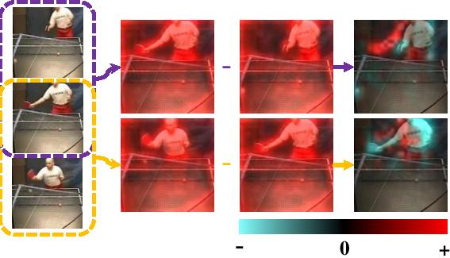

# Optical Flow Guided Feature: A Fast and Robust Motion Representation for Video Action Recognition



### Update
All the codes and models have been released! We'll post a blog to discuss the details and observations in OFF.

---

This repo holds the implementation code of the paper:

[Optical Flow Guided Feature: A Fast and Robust Motion Representation for Video Action Recognition](http://openaccess.thecvf.com/content_cvpr_2018/papers/Sun_Optical_Flow_Guided_CVPR_2018_paper.pdf), [Shuyang Sun](https://kevin-ssy.github.io/), [Zhanghui Kuang](http://jeffreykuang.github.io/index.html), [Lu Sheng](http://www.ee.cuhk.edu.hk/~lsheng/), [Wanli Ouyang](https://wlouyang.github.io/), [Wei Zhang](), CVPR 2018.

### Prerequisites
- OpenCV 2.4.12
- OpenMPI 1.8.5 (enable-thread-multiple when install)
- CUDA 7.5
- CUDNN 5
- [Caffe Dependencies](http://caffe.berkeleyvision.org/install_apt.html)

You may refer to the project [TSN](https://github.com/yjxiong/temporal-segment-networks) to install these libs and prepare the data.

### How to Build

For training use, first modify the file ```make_train.sh``` with your own lib path filled in. Simply run ```sh make_train.sh```, the script will automatically build the caffe for you.

For testing, you can simply run ```make pycaffe``` to make all stuff well prepared.

### Training
You need to make two folders before you launch your training. The one is ```logs``` under the root of this project, and the other is the ```model``` under the folder ```models/DATASET/METHOD/SPLIT/```. For instance, if you want to train ```RGB_OFF``` on the dataset ```UCF101 split 1```, then your ```model``` directory should be made under the path ```models/ucf101/RGB_OFF/1/```. The models for initialization and reference will be available soon.

The network structure for training is defined in ```train.prototxt```, and the hyperparameters are defined in ```solver.prototxt```. For detailed training strategies and observations not included in the paper, please refer to our **[training recipes]()**.


### Testing
You need to create another directory ```proto_splits``` under the same folder of ```model```. Our test code use pycaffe to call the functions defined in C++, therefore, we need to write some temporary files for synchronization. Remember to clean the temporary files everytime you launch a new test. Run the script ```test.sh``` with your ```METHOD```, ```MODEL_NAME```, ```SPLIT``` and ```NUM_GPU``` specified. 

The ```deploy_tpl.prototxt``` defines the network for reference. To transfer your network defined in ```train.prototxt``` into ```deploy_tpl.prototxt```, you may need to copy all the layers except the data layer and layers after each fully connected layer. As there are dynamic parameters defined in the ```deploy_tpl.prototxt```, e.g. ```$SOURCE $OVERSAMPLE_ID_PATH```, the format of the ```deploy_tpl.prototxt``` is a little bit different to the normal prototxt file.

### Results
Due to the unexpected server migration, our original models trained on all 3 splits of UCF101 and HMDB51 were all lost. Therefore, we re-train the models on the first split of UCF101:

| RGB | OFF(RGB) | RGB DIFF | OFF(RGB DIFF) |   FLOW  | OFF(FLOW) |   Acc. (Acc. in Paper)  | 
| :-: |    :-:   |    :-:   |      :-:      |   :-:   |    :-:    |   :-:   |
|<ul><li>[x] </li></ul>|<ul><li>[x] </li></ul>|<ul><li>[ ] </li></ul>|<ul><li>[ ] </li></ul>|<ul><li>[ ] </li></ul>|<ul><li>[ ] </li></ul>|  90.5% (90.0%) |
|<ul><li>[x] </li></ul>|<ul><li>[x] </li></ul>|<ul><li>[x] </li></ul>|<ul><li>[x] </li></ul>|<ul><li>[ ] </li></ul>|<ul><li>[ ] </li></ul>|  93.2% (93.0%)|
| <ul><li>[x] </li></ul> |<ul><li>[x] </li></ul>|<ul><li>[ ] </li></ul>|<ul><li>[ ] </li></ul>|<ul><li>[x] </li></ul>|<ul><li>[x] </li></ul>|  95.3% (95.5%) |

### Models
Models on Google Drive will be available soon.

| Model Name | Init Model | Reference Model |
| :-:        | :-:        | :-:             |
| OFF(RGB)      | [Baidu Pan](https://pan.baidu.com/s/1LSgYPFuy0rWYZkj9zu0Z1A) <br> [Google Drive](#) | [Baidu Pan](#) <br> [Google Drive](#)
| OFF(RGB DIFF) | [Baidu Pan](https://pan.baidu.com/s/1kV6djzC6wU6T6x9F6D41CA) <br> [Google Drive](#) | [Baidu Pan](https://pan.baidu.com/s/1xBHf2SOAbbO65vkpK2FRaQ) <br> [Google Drive](#) |
| OFF(Flow)     | [Baidu Pan](https://pan.baidu.com/s/1oyJebhCMJDuaC6EZ0GdHDA) <br> [Google Drive](#) | [Baidu Pan](https://pan.baidu.com/s/1-CXs8WPQnG1aadA6Z3daqA) <br> [Google Drive](#) |


### Release Schedule
- [x] Paper Link
- [x] Network Prototxt
- [x] Testing Code
- [x] Training Code
- [x] Pretrained Models
- [ ] Training Recipes
- [x] Building Docs

### Citation
If you find our research useful, please cite the paper:
```
@InProceedings{Sun_2018_CVPR,
author = {Sun, Shuyang and Kuang, Zhanghui and Sheng, Lu and Ouyang, Wanli and Zhang, Wei},
title = {Optical Flow Guided Feature: A Fast and Robust Motion Representation for Video Action Recognition},
booktitle = {The IEEE Conference on Computer Vision and Pattern Recognition (CVPR)},
month = {June},
year = {2018}
}
```

### Related Project
[Temporal Segment Networks](https://github.com/yjxiong/temporal-segment-networks)

### Contact
You can contact Mr.Shuyang Sun (Please do NOT call me with the title Prof., Dr., or any other kinds of weird prefixes. I'm still a master student....) by sending email to shuyang.sun@sydney.edu.au
